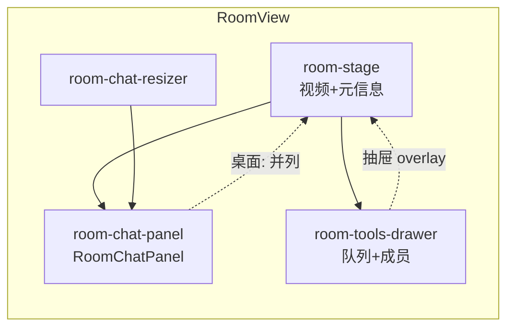

# 房间聊天：Twitch 风格可伸缩侧边栏 — 设计说明

> 文档版本：v1.0  
> 创建时间：2026-05-19  
> 状态：已确认，待实现（本文档为方案定稿，不含实现代码）

---

## 1. 文档目的

将房间页聊天从「多功能侧栏内、固定 14rem 高的区块」升级为与视频**左右并列**的独立聊天列，支持桌面端拖拽调宽与折叠；队列与成员迁至独立工具抽屉。本文档汇总全部已确认的产品与技术决策，作为实现与验收依据。

---

## 2. 已确认决策总表

| # | 决策项 | 确认结果 |
|---|--------|----------|
| 1 | 队列 / 成员归宿 | **方案 A**：独立「工具抽屉」，与聊天列解耦 |
| 2 | 聊天默认位置 | **仅右侧**（本期不做左侧切换） |
| 3 | 交付范围 | **桌面端与移动端同期完成** |
| 4 | 桌面工具抽屉形态 | **右侧滑入抽屉**，宽 `min(420px, 90vw)` |
| 5 | 移动端聊天形态 | **底部 Sheet**，默认约 **65vh**，可上拖至近全屏 |
| 6 | 移动端入口 | 视频区下方 **「聊天」** + **「队列与成员」** 双按钮，**互斥** |
| 7 | 聊天默认宽度 | `340px`；最小 `280px`；最大 `min(480px, 38vw)` |
| 8 | 宽度持久化 | `localStorage` 键 `wtt.roomChatPanel.v1` |
| 9 | 折叠聊天列 | **包含**（收起后窄条 + 展开按钮） |
| 10 | 新消息滚动 | 在底部自动滚到底；上滑时显示 **「↓ 新消息」** |
| 11 | 未读角标 | **本期不做**（记入 P2） |
| 12 | 输入快捷键 | `Enter` 发送；`Shift+Enter` 换行 |
| 13 | 全屏播放 | 全屏时 **隐藏聊天列**；退出全屏后恢复宽度与折叠状态 |
| 14 | 后端 / 实时 | **不改** API、Ably 事件、消息结构 |

---

## 3. 背景与现状

### 3.1 当前实现（WatchTvTogether-Web）

| 区域 | 位置 / 文件 | 问题 |
|------|-------------|------|
| 布局 | `src/assets/styles.css` — `.room-layout`（grid：`1fr \| 300–400px`） | 右栏固定宽度，不可调 |
| 房间页 | `src/views/RoomView.vue`（单文件含播放、队列、聊天、成员） | 聊天 buried，难维护 |
| 聊天 UI | 侧栏内 `AppCard`，`.room-chat-log` **`max-height: 14rem`** | 消息区过小 |
| 侧栏内容顺序 | 队列 → 聊天 → 成员 | 聊天在队列下方，不便边看边聊 |
| 移动端 ≤960px | 整块 `.room-sidebar` 右滑抽屉，按钮「队列与成员」 | 聊天与队列绑定，入口不直观 |
| 数据层 | `useRoomRealtime`、`fetchRoomChatHistory`、`postRoomChat` | 可复用，无需改动 |

### 3.2 用户目标

- 视频与聊天**左右并列**，视线无需在播放器与页面底部之间切换。
- 聊天列**可拖拽调节宽度**（参考 Twitch）。
- 聊天区**占满可用高度**，输入框固定底部。
- 队列 / 成员仍可用，但不占用聊天列空间。

---

## 4. 设计目标与非目标

### 4.1 目标

1. 桌面（≥961px）：视频左、聊天右；聊天列全高、可拖拽改宽、可折叠。
2. 移动（≤960px）：视频全宽；聊天为底部 Sheet；队列为右侧工具抽屉。
3. 聊天优先：进房即可发消息，无需先打开「队列与成员」。
4. 组件化：抽出 `RoomChatPanel` 等，降低 `RoomView.vue` 体积。
5. 偏好持久化：宽度、折叠状态写入 `localStorage`。

### 4.2 非目标（本期）

- 后端 API、Ably 频道事件、消息字段变更。
- 表情、@、回复、慢模式、Moderator、打赏等高级聊天。
- 聊天列左右切换、多房间分屏、画中画聊天。
- 移动端 App 图标式未读角标（P2）。
- 全屏时聊天半透明 overlay（P2）。

---

## 5. 信息架构

### 5.1 桌面端（≥961px）

```
┌──────────────────────────────────────────────────────────────────┐
│ App topbar                                                        │
├────────────────────────────────────────────┬─┬───────────────────┤
│ .room-stage (flex: 1; min-width: 0)      │║│ .room-chat-panel   │
│  ┌────────────────────────────────────┐  │║│  [聊天]      [收起] │
│  │ 视频 16:9 + player chrome          │  │║│  ┌───────────────┐ │
│  └────────────────────────────────────┘  │║│  │ 消息列表       │ │
│  标题 / 实时状态 / 当前视频摘要           │║│  │ (flex: 1)      │ │
│  [聊天] [队列与成员] …（舞台区操作条）     │║│  └───────────────┘ │
│                                          │║│  composer（固定底）│
└────────────────────────────────────────────┴─┴───────────────────┘
                                              ↑ .room-chat-resizer

（工具抽屉打开时：自右缘滑入，宽 min(420px, 90vw)，可覆盖在聊天列左侧或舞台右缘，见 §6.2）
```

- **`.room-stage`**：播放器 + 必要元信息；视频保持 `aspect-ratio: 16/9`，`min-width: 0` 防止 flex 子项撑破布局。
- **`.room-chat-panel`**：仅含聊天（消息列表 + 输入区），**不含**队列、成员。
- **`.room-chat-resizer`**：聊天列左缘 4–6px 拖拽热区，`cursor: col-resize`。

### 5.2 移动端（≤960px）

```
┌─────────────────────┐
│ 视频（全宽）         │
│                     │
├─────────────────────┤
│ [聊天] [队列与成员]  │  ← 舞台底部操作条（sticky 可选）
└─────────────────────┘

点击「聊天」→ 底部 Sheet（~65vh，可上拖近全屏）
点击「队列与成员」→ 右侧工具抽屉（与现逻辑类似）
二者互斥：打开其一则关闭另一。
```

### 5.3 模块关系



---

## 6. 交互规格

### 6.1 桌面 — 聊天列宽度

| 项 | 值 |
|----|-----|
| 默认宽度 | `340px` |
| 最小宽度 | `280px` |
| 最大宽度 | `min(480px, 38vw)` |
| 拖拽 | `pointerdown` → `pointermove` 更新 → `pointerup` 结束；拖拽中 `user-select: none` |
| 双击 resizer | 恢复默认宽度 `340px`（建议实现） |
| 实现建议 | CSS 变量 `--room-chat-width`；`requestAnimationFrame` 节流 |

**持久化：**

```json
// localStorage key: wtt.roomChatPanel.v1
{
  "width": 340,
  "collapsed": false
}
```

- 非法 JSON 或越界数值回退默认。
- `window.resize` 时若已存宽度大于当前 `maxAllowed`，钳制到 `maxAllowed`。

### 6.2 桌面 — 工具抽屉（方案 A）

| 项 | 规格 |
|----|------|
| 触发 | 舞台区按钮「队列与成员」 |
| 形态 | **右侧滑入**，宽 `min(420px, 90vw)` |
| 内容 | 与现 `.room-sidebar` 内队列卡片 + 成员卡片一致（播放模式、添加 URL、队列项操作、Presence 列表、踢人等） |
| 关闭 | 关闭按钮、点击 backdrop、Esc |
| 与聊天关系 | 打开工具抽屉 **不关闭** 聊天列（桌面聊天列常显）；若实现上 z-index 冲突，工具抽屉覆盖在聊天列之上 |
| 开发模式事件卡片 | 仍放在工具抽屉内底部（仅 `isDev`） |

### 6.3 桌面 — 折叠聊天列

| 项 | 规格 |
|----|------|
| 触发 | 聊天 header「收起」 |
| 折叠后 | 宽度动画至 `0` 或保留约 `40px` 竖条 + 「展开聊天」 |
| 折叠时 | 舞台区 `flex: 1` 占满剩余宽度 |
| 持久化 | `collapsed` 写入 `wtt.roomChatPanel.v1` |
| 键盘 | resizer 聚焦时 `ArrowLeft` / `ArrowRight` 步进 `16px` |

### 6.4 移动端 — 聊天 Sheet

| 项 | 规格 |
|----|------|
| 触发 | 「聊天」按钮 |
| 默认高度 | 视口高度约 **65%**（65vh） |
| 上拖 | 可拖至近全屏（如 92vh），带 snap 点 |
| 结构 | 上：拖拽把手（可选）+ 标题「聊天」+ 关闭；中：消息列表 `flex: 1`；底：composer 固定 |
| 关闭 | 下滑超过阈值、关闭按钮、点击 backdrop |
| 与工具抽屉 | **互斥** |

### 6.5 移动端 — 工具抽屉

| 项 | 规格 |
|----|------|
| 触发 | 「队列与成员」按钮 |
| 形态 | 沿用现 **右侧全高 drawer**（`transform: translateX`）+ backdrop |
| 内容 | 队列 + 成员（无聊天区块） |
| 与聊天 Sheet | **互斥** |

### 6.6 消息列表行为

| 场景 | 行为 |
|------|------|
| 历史加载完成 | 滚动到底部 |
| 收到新消息且用户在底部（距底 ≤80px） | 自动滚到底部 |
| 用户上滑阅读 | 不自动滚动；显示悬浮 **「↓ 新消息」**，点击滚到底 |
| 发送成功 | 滚到底部；可选聚焦输入框 |
| 长文本 | `word-break: break-word` |
| 移除 | `.room-chat-log` 的 `max-height: 14rem` |

### 6.7 输入区（Composer）

| 项 | 规格 |
|----|------|
| 布局 | 列：`textarea` → 字数 `count / 2000` → 错误 → 发送按钮 |
| 快捷键 | `Enter` 发送；`Shift+Enter` 换行 |
| 禁用态 | `chatBlocked` / `chatSending` / `chatLoading` 逻辑不变 |
| 占位 | 与现文案一致（「发送消息…」/「聊天暂不可用」） |

### 6.8 全屏播放

| 状态 | 聊天列 |
|------|--------|
| 进入全屏 | **隐藏** `.room-chat-panel` 与 resizer |
| 退出全屏 | 恢复进入前宽度与 `collapsed` 状态（内存态即可，与 localStorage 一致） |

---

## 7. 响应式断点

| 断点 | 布局 |
|------|------|
| `≥961px` | `display: flex`；`height: calc(100vh - var(--topbar-h) - 页面 padding)`；聊天列常显、可 resize、可折叠 |
| `≤960px` | 单列舞台；聊天 Sheet + 工具 drawer；**无**宽度拖拽 |
| `≤640px` | 继承现有 `.player-chrome` 简化（如隐藏音量滑条） |

**布局实现建议：** `.room-layout` 由 `grid` 改为 **`flex`**，舞台 `flex: 1; min-width: 0`，聊天列宽度由 `--room-chat-width` 控制。

---

## 8. 组件与文件结构（实现参考）

```
src/
  components/
    room/
      RoomChatPanel.vue       # 消息列表 + composer + 新消息提示
      RoomChatResizer.vue     # 桌面拖拽手柄（或合并进 composable）
      RoomToolsDrawer.vue     # 队列 + 成员 + dev 事件
      RoomChatSheet.vue       # 移动端底部 Sheet 外壳（可选，或与 Panel 组合）
  composables/
    useRoomChatPanelLayout.ts # 宽度、折叠、localStorage、断点、全屏联动
    useChatScroll.ts          # 是否在底部、新消息按钮（可选）
  views/
    RoomView.vue              # 编排 stage / chat / tools / sheet
  assets/
    styles.css                # 更新 .room-layout；移除旧「单列 grid 右栏含聊天」规则
docs/
  chat_design.md              # 本文档
```

### 8.1 `RoomChatPanel` 接口（草案）

**Props：**

| 名称 | 类型 | 说明 |
|------|------|------|
| `messages` | `RoomChatMessage[]` | 升序展示列表 |
| `loading` | `boolean` | 历史加载中 |
| `banner` | `string \| null` | 顶部提示 |
| `blocked` | `boolean` | 是否禁止发送 |
| `sending` | `boolean` | 发送中 |
| `sendError` | `string \| null` | 发送错误 |
| `displayName` | `(user) => string` | 昵称展示 |

**Emits：**

| 事件 | 载荷 |
|------|------|
| `send` | `text: string` |

状态（`chatDraft`、`sendChatMessage` 等）可由 `RoomView` 持有后传入，不强制新建 Pinia store。

### 8.2 `RoomToolsDrawer` 接口（草案）

**Props：** `open`、`queue`、`members`、`canControl` 等（从 `RoomView` 现有 props/state 透传）。

**Emits：** `close`、队列操作相关事件（或继续在 `RoomView` 内处理，抽屉仅负责展示与转发）。

---

## 9. 样式要点

| 类名 | 职责 |
|------|------|
| `.room-layout` | flex 容器，全高 |
| `.room-stage` | 左栏弹性区 |
| `.room-chat-panel` | 右栏聊天；`display: flex; flex-direction: column; height: 100%` |
| `.room-chat-messages` | `flex: 1; overflow-y: auto; min-height: 0` |
| `.room-chat-composer` | `flex-shrink: 0` |
| `.room-chat-resizer` | 绝对或负 margin 贴聊天列左缘 |
| `.room-chat-panel.is-collapsed` | 宽度 0 或窄条 |
| `.room-tools-drawer` | 工具抽屉；桌面/移动共用内容，外壳响应式 |
| `.room-chat-sheet` | 移动 Sheet；`border-radius` 顶圆角 |

删除或替换：`styles.css` 中将聊天与队列绑在同一 `.room-sidebar` 固定列宽的规则；`RoomView.vue` 中 `.room-chat-log { max-height: 14rem }`。

---

## 10. 无障碍（a11y）

| 元素 | 要求 |
|------|------|
| 消息列表 | `role="log"`，`aria-live="polite"` |
| Resizer | `role="separator"`，`aria-orientation="vertical"`，`aria-valuenow/min/max` |
| 折叠按钮 | `aria-expanded` |
| Sheet / 抽屉打开 | focus trap；关闭后焦点回到触发按钮 |
| 新消息按钮 | 可读标签，如「跳至最新消息」 |

---

## 11. 数据流（不变）

```
进入房间
  → GET /api/rooms/:id/chat（历史，limit 80）
  → 填入 rtChatMessages（useRoomRealtime）

发送
  → POST /api/rooms/:id/chat
  → 乐观更新 + 他人经 Ably room.chat 接收

实时
  → useRoomRealtime 订阅 room.chat
```

实现阶段 **禁止** 修改 `api.ts` 聊天接口签名及 `useRoomRealtime` 事件名，除非发现阻塞性 bug。

---

## 12. 风险与缓解

| 风险 | 缓解 |
|------|------|
| `RoomView.vue` 过大，重构回归 | 先抽 `RoomChatPanel` 再改布局；手工验证播放同步 + 发消息 |
| 窄屏视频过窄 | `max-width` 钳制；宽度 &lt; 1024px 时可提示收起聊天 |
| 拖拽与选中冲突 | `preventDefault` + 临时 `user-select: none` |
| Sheet 与 drawer 同时打开 | 统一 `activeOverlay: 'chat' \| 'tools' \| null` 状态机 |
| 全屏与 resize 状态 | 全屏仅隐藏 DOM，不清空 localStorage |

---

## 13. 验收标准

### 13.1 桌面

- [ ] 进房后右侧可见完整高度聊天列，无 14rem 限高。
- [ ] 拖拽左缘可改变宽度，刷新后宽度保持。
- [ ] 折叠后舞台变宽，展开后恢复。
- [ ] 「队列与成员」打开工具抽屉，含队列与成员，**不含**聊天。
- [ ] 播放、房主控进度、Ably 同步正常。
- [ ] `Enter` 发送、`Shift+Enter` 换行生效。
- [ ] 上滑阅读时出现「↓ 新消息」并可点击滚底。
- [ ] 视频全屏时聊天隐藏，退出后恢复。

### 13.2 移动

- [ ] 「聊天」打开底部 Sheet，约 65vh，可上拖近全屏。
- [ ] 「队列与成员」打开右侧工具抽屉。
- [ ] 二者互斥，不可同时打开。
- [ ] Sheet 内可加载历史、发送消息、接收实时消息。

### 13.3 回归

- [ ] `npm run test` 通过（若有相关测试需补充）。
- [ ] `npx vue-tsc --noEmit` 无新增错误。

---

## 14. 实施顺序建议（实现阶段）

| 步骤 | 内容 |
|------|------|
| 1 | 抽出 `RoomChatPanel`，去掉 `max-height: 14rem`，在临时布局下验证发送/接收 |
| 2 | 桌面 `flex` 布局 + `useRoomChatPanelLayout` + `RoomChatResizer` + localStorage |
| 3 | 折叠、新消息滚动、`Enter` 发送 |
| 4 | 抽出 `RoomToolsDrawer`，迁移队列/成员，桌面右侧抽屉 |
| 5 | 移动端 `RoomChatSheet` + 双按钮互斥 + 工具 drawer 去聊天块 |
| 6 | 全屏隐藏聊天列；整体验收 §13 |

---

## 15. P2  backlog（本期不做）

- 移动端未读消息角标 / 按钮红点。
- 全屏时聊天半透明 overlay。
- 消息时间戳、头像、房主/管理员徽章样式。
- 双击 resizer 以外的高级手势（若 v1 未做双击复位，可补入 P2）。

---

## 16. 参考文件（现状）

| 文件 | 说明 |
|------|------|
| `src/views/RoomView.vue` | 房间主视图，待拆分 |
| `src/assets/styles.css` | `.room-layout`、`.room-sidebar`、drawer 媒体查询 |
| `src/composables/useRoomRealtime.ts` | `room.chat`、 `chatMessages` |
| `src/api.ts` | `fetchRoomChatHistory`、`postRoomChat` |
| `src/types.ts` | `RoomChatMessage` |

---

## 17. 变更记录

| 日期 | 版本 | 说明 |
|------|------|------|
| 2026-05-19 | v1.0 | 初稿：用户确认方案 A、仅右侧聊天、双端同期；其余项全部采用推荐默认值 |
